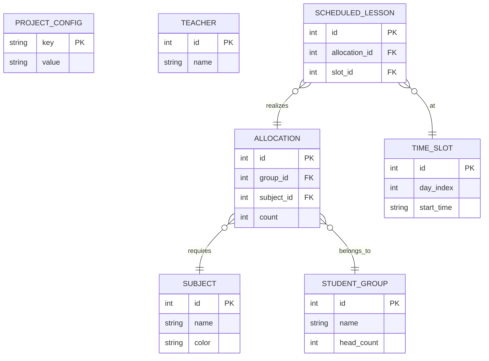

# 🏗 Architecture Technique & Données

## Vue d'ensemble

Kronos utilise une architecture **Monolithe Modulaire Local**.

- **Frontend (UI)** : Gère l'affichage et la saisie utilisateur. Il ne stocke rien.
- **Backend (Rust)** : Gère la logique, les calculs lourds et l'accès disque.
- **State** : La connexion BDD est maintenue dans un `Mutex<rusqlite::Connection>` au sein de l'état Tauri.

## 💾 Base de Données (SQLite)

Le fichier de base de données est créé localement au premier lancement (`kronos.db`).

### Schéma Relationnel

### Description des Tables Clés

- **`project_config`** : Table clé-valeur essentielle.
  - `school_mode` : `SINGLE_CLASS` (cache les profs/salles) ou `MULTI_CLASS`.
  - `slot_duration` : Durée d'un "bloc" (ex: 30, 45, 60 min).

- **`allocations`** : Représente la demande brute.
  - Exemple : "Le groupe CM2-A (id=1) veut 4 blocs de Maths (id=5)".

- **`scheduled_lessons`** : Représente la solution calculée.
  - Exemple : "L'allocation #12 est placée le Lundi à 08h00".

## 🔄 Flux de Données (Data Flow)

1. **Initialisation** : Tauri lance `init_db`. Si la base est vide, création des tables.
2. **Configuration** : L'utilisateur choisit le "Profil". Cela écrit dans `project_config`.
3. **Saisie** : Le Front envoie des commandes (`create_subject`, `set_allocation`) au Rust qui écrit via `rusqlite` (Sync).
4. **Génération** :
    - Rust charge toutes les allocations et constraints en mémoire (RAM).
    - L'algo tourne sans toucher à la DB.
    - Une fois terminé, Rust fait un `INSERT` massif des résultats dans `scheduled_lessons`.
